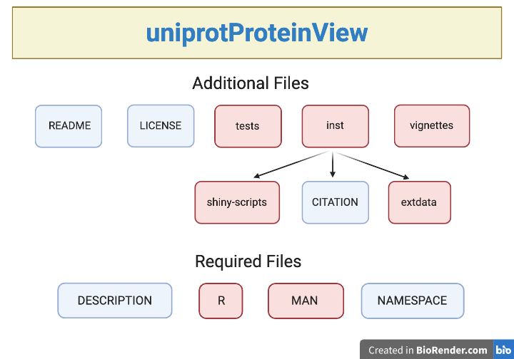
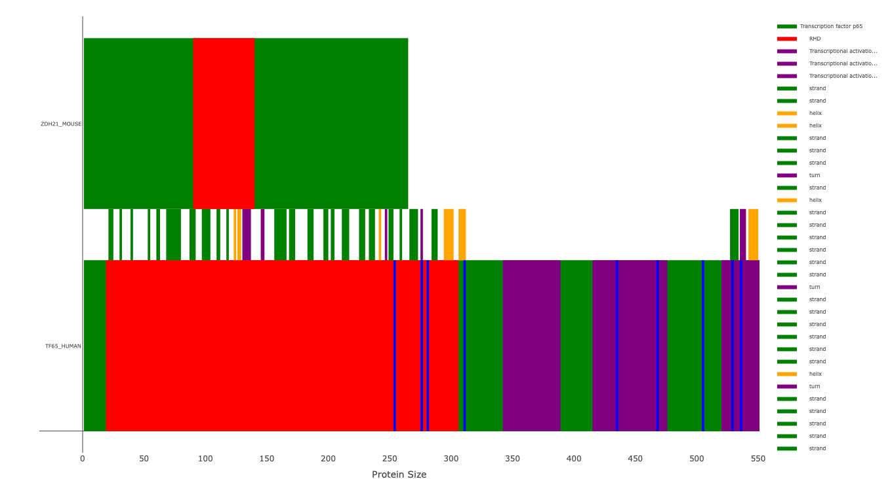

```{r, include = FALSE}
knitr::opts_chunk$set(
  collapse = TRUE,
  comment = "#>",
  fig.path = "man/figures/README-",
  out.width = "100%"
)
```

# uniprotProteinView

<!-- badges: start -->
<!-- badges: end -->

The goal of uniprotProteinView is to provide a means to show a graphical representation of the UniProt data as well as allow easy cross-comparison of features between different proteins for easy analysis of protein features.

# Installation

To download package:

```r
install.packages("devtools")
devtools::install_github("zzaassaa2/uniprotProteinView", build_vignettes = TRUE)
library("uniprotProteinView")
```

# Overview

The uniprotProteinView package provides six functions. However the user will normally only need to use two: `drawProtein()`, the main drawing function, or `runUniprotProteinView()`, a function that opens up an interactive Shiny app. To see further documentation:

```r
ls("package:uniprotProteinView")
```

To view an interactive Shiny app, you can visit the webpage [Shiny App](https://zzaassaa2.shinyapps.io/proteinView/), or call the function:

```r
uniprotProteinView::runUniprotProteinDraw()
```

For more information on the package, call:

```r
browseVignettes("uniprotProteinView")
```

Package overview:

<div style="text-align:center">Created with BioRender.com</div>


# Contributions

The author of the package is George Zorn. The xml retrieval functions make use of the `XML` and `httr` R packages for xml parsing and data retrieval, respectively. The plot drawing functions make use of the `plotly` R package in order to draw and label the plot. The package also makes use of Shiny to create an interactive app. Secondary inclusions are the `rgb()` function from `grDevices`, `runif()` from `stats`, and `download.file()`, `setTxtProgressBar()`, and `txtProgressBar()` functions from the `utils` package.

The Shiny app also makes use of the Cerulean css file provided by [Bootswatch](https://bootswatch.com/cerulean/), free, opensource css themes.

# References

Chang, W., Cheng J., Allaire J., Xie Y., McPherson J. (2017). Shiny: web application framework for R.

Park T. Bootswatch. (2020). GitHub Repository. https://github.com/thomaspark/bootswatch

Plotly R Open Source Graphing Library. Plotly. Website. https://plotly.com/r/

R Core Team (2017). R: A language and environment for statistical computing. R Foundation for Statistical Computing, Vienna, Austria. Website. https://www.R-project.org/.

The UniProt Consortium. UniProt: a worldwide hub of protein knowledge. *Nucleic Acids Res.* 47: D506-515 (2019)

Wickham, H. and Bryan, J. (2019). R Packages (2nd edition). Newton, Massachusetts: O’Reilly Media. https://r-pkgs.org/

# Acknowledgements

This package was developed as part of an assessment for 2020BCB410H: Applied Bioinformatics, University of Toronto, Toronto, CANADA.

# Examples

The most simple usage of the function `drawProtein` is to supply it with a protein key_code. This can be found from the UniProt webpage at [UniProt](https://www.uniprot.org/). Once there, search for your protein and get the protein key_code.

This code can then be used as shown below. As an example, we will use human transcription factor p65, with code Q04206.

```r
#Note: that your protein will be a different color than the image shown, by default the function chooses a random color
uniprotProteinView::drawProtein("Q04206")
```

<div style="text-align:center"></div>

Here the function will search the UniProt database for the protein and then draw the main chain. Further details about the structure can be added. For further information, look through the vignettes.

An example of a more advanced usage with two proteins is:

```r
uniprotProteinView::drawProtein(
  proteins = list(type = c("Q04206", "Q9D270"), colors = c("green", "green")),
  types = list(type = c("domain", "region of interest"), colors = c("red", "purple")),
  descriptionSearch = list(type = "phos", colors = "blue"),
  offSetFeatures = list(type = c("strand", "helix", "turn"), colors = c("green", "orange", "purple"))
)
```

<div style="text-align:center"></div>

For further information see the vignettes.