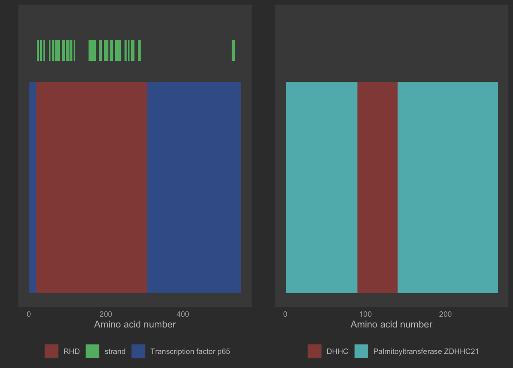

# uniprotProteinView

<!-- badges: start -->
<!-- badges: end -->

!!!!!NOTE: if you are one of the reviewers for this package, I noticed only one person has done it so far, thus if you are trying to submit a review, look at the 0.1.0 branch, this current one is in dev and unstable.


The goal of uniprotProteinView is to provide a means to show a graphical representation of the UniProt data as well as allow easy cross comparison of features between different proteins for easy analysis of protein features.

## Installation

To download package:

``` r
install.packages("devtools")
devtools::install_github("zzaassaa2/uniprotProteinView", build_vignettes = TRUE)
library("uniprotProteinView")
```

## Overview

``` r
ls("package:uniprotProteinView")
```

The uniprotProteinView package provides a variety of functions, separated into three main branches: Retrieval of data and parsing xml, parsing xml data into dataFrames and into feature lists, and drawing of data onto one or more plots.
For more information, refer to package vignettes.

``` r
browseVignettes("uniprotProteinView")
```

## Contributions

The author of the package is George Zorn. The xml retrieval functions make use of the `XML` and `httr` R packages for xml parsing and data retrieval, respectively, with the *getProteinRemoteD* function also making use of the `stringr` R package. The plot drawing functions make use of the `ggplot2` R package in order to draw and label the plot. The *plotProteins* function makes use of the R package `cowplot` in order to draw multiple plots on the same window.

## References

Wickham, H. and Bryan, J. (2019). R Packages (2nd edition). Newton, Massachusetts: O’Reilly Media. https://r-pkgs.org/

The UniProt Consortium. UniProt: a worldwide hub of protein knowledge. Nucleic Acids Res. 47: D506-515 (2019)

## Acknowledgements

This package was developed as part of an assessment for 2020BCB410H: Applied Bioinformatics, University of Toronto, Toronto,CANADA.

## Example

``` r
    xmls <- getProteinRemote(c("Q04206", "Q9D270"))
    features <- getFeatureList(xmls)
    data <- featuresToDataFrame(features)
    plots <- drawPlot(data)
    plots <- elementIfMatch(plots, data, "chain")
    plots <- drawDomains(plots, data)
    plots <- drawBetaStrands(plots, data)
    plotProteins(plots)
```

