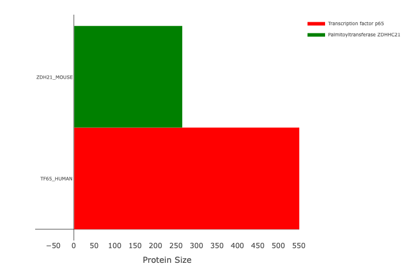

```{r, include = FALSE}
knitr::opts_chunk$set(
  collapse = TRUE,
  comment = "#>"
)
```

# Overview

This package provides the user the means to plot proteins with specified features plotted out, as provided from the UniProt API. There are four functions exported, the main two are `drawProtein()` and `runUniprotProteinView().` The other two are `getProtein()` and `getFeaturesDataFrame()`. The user will normally only need to use `drawProtein(),` the main drawing function, and `runUniprotProteinView(),` a function that starts the Shiny app. If the user should wish to view an interactive shiny app, without calling the function `runUniprotProteinView(),` then they can do so at [Shiny App](https://zzaassaa2.shinyapps.io/proteinView/).

# Run Shiny App

The Shiny app provides an interactive means to use the graph, viewable by either using the website: [Shiny App](https://zzaassaa2.shinyapps.io/proteinView/), or running:

```r
uniprotProteinView::runUniprotProteinView()
```

# Plotly Graph

The plotly graph allows the user to see a graph and legend with ease. If the user wishes to no longer view an element, simply click the element on the legend and it will no longer be visible. The user can also zoom in on the X or Y axis, or on a specified box region. Further, the user have hove their cursor over an element on the graph to view the full features name and length

# Draw Proteins

The simplest usage of the `drawProtein()` function is to provide it a string of the UniProt protein ID, that can be found at [UniProt](https://www.uniprot.org/) where the user can then find their desired protein, and get the protein key_code

This code can then be used as shown below. For this example, we will use human transcription factor p65, with code Q04206.

```r
uniprotProteinView::drawProtein("Q04206")
```

This function will then search the UniProt database, retrieve an .xml file, parse the data, make a dataframe of all the proteins features, as specified in the API, and then draw all specified features to frame. Since this function is empty beyond the protein key_code, only the primary chain is drawn. Further, the color of the primary chain will vary everytime this function is called, because a color hasn't been specified, and thus a random color will be chosen. To specify a protein color, use the following format:

```r
uniprotProteinView::drawProtein(list(type = "Q04206", colors = "red"))
```

The output to this function should look something like this


To note is that the function can also retrieve information from locally downloaded .xml files, should they be of the proper format. To retrieve a file, simply go to the protein page, add .xml to the end, and then download that page, so for the Q04206 protein: [UniProt](https://www.uniprot.org/uniprot/Q04206.xml). To search for these files instead, put the file name instead

```r
#This will look in the local directory that the function is running from by default, so specify a location add the absolute file path, or ./ for a local directory
uniprotProteinView::drawProtein(list(type = "Q04206.xml", colors = "red"))
```

If the file can't be found, then the user will be prompted to either choose to skip the protein, stop the operation all together, or download the file, and then load it from there. The file will always be downloaded to the current working directory.

Multiple proteins can be viewed at the same time using either a vector or list

```r
#These two function will respond the same way

uniprotProteinView::drawProtein(c("Q04206", "Q9D270"))#Using a vector

uniprotProteinView::drawProtein(list("Q04206", "Q9D270"))#Using a list
```

To specify color, use this function to generate this image:

```r
uniprotProteinView::drawProtein(list(type = c("Q04206", "Q9D270"), colors = c("red", "green")))
```



To draw features, the function will do a literal match (ignores capitalization) of the features "type" to see if the specified string matches, if it does, then it will draw the feature to frame for the specific protein. An example is

```r
uniprotProteinView::drawProtein(
                                proteins = list(type = c("Q04206", "Q9D270"), colors = c("red", "green")),
                                types = list(type = c("region of interest", "domain"), colors = "purple")
)
```

Notice here, that two features are being search for, "region of interest" and "domain", however only one color is specified, because of this, all "region of interest" areas will have the color purple, while the domain areas will have a random color choosen for them, the plot should look similar to this, excluding "domain" color:


If the user wishes to view the XML and features dataframe, specify the argument `saveGlobal` to TRUE. The format of the XMLS, saved to the global variable `uniProtProteinView_xmls` will be a list containing XMLS data for each protein, the same is true for dataframes for the feature dataframes, stored in the global variable `uniProtProteinView_data`.

As a final note, if the user wishes to download there plot as a .png within the IDE viewer, often the plotly button will not work, even if it says it has downloaded, To resolve this, save the plot as an html using the following code, open the .html document, and then use the download button.

```r
plotIn <- uniprotProteinView::drawProtein("Q04206")
htmlwidgets::saveWidget(plotIn, file = "image.html")
```

For further information consult the other vignette, `Advance_Specifications`.
